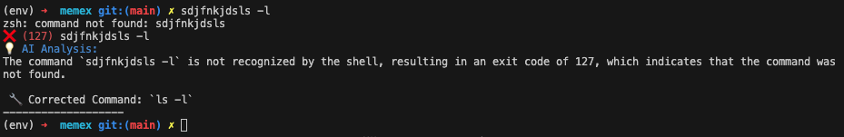

# Command AI Assistant

A ZSH plugin that uses Ollama to analyze command execution and provide instant AI-powered feedback when commands fail or produce unexpected results.



## Features

- 🔍 Automatically monitors command execution
- ❌ Detects failed commands and non-zero exit codes
- 🤖 Provides AI-powered analysis using Ollama
- ✨ Clean, colorized output in your terminal
- ⚡ Lightweight and fast (only analyzes when needed)

## Prerequisites

- ZSH shell
- [Ollama](https://ollama.ai/) installed and running
- A compatible Ollama model (default: llama3.2)

## Installation

1. Install Ollama: 

macOS/Linux:
```bash
curl -fsSL https://ollama.ai/install.sh | sh
```
2. Start Ollama service
    ```
    ollama serve
    ```

2. Pull the default model:

    ```bash
    ollama pull llama3.2
    ...
    verifying sha256 digest 
    writing manifest 
    success 
    ✅  ollama pull llama3.2    
    ```

3. Install the plugin:


2. Create plugins directory if it doesn't exist
```bash
mkdir -p ~/.zsh/plugins
Clone this repository
git clone https://github.com/yourusername/command-ai-assistant.git
cp command-ai-assistant/last-command.plugin.zsh ~/.zsh/plugins/
```
4. Add to your `~/.zshrc`:
```bash
source ~/.zsh/plugins/last-command.plugin.zsh
```
5. Reload your shell:
```bash
source ~/.zshrc
```
## Usage

Simply use your terminal as normal. The plugin will automatically:
- Monitor command execution
- Show exit codes
- Provide AI analysis for failed commands

Example output:
```bash
$ ls /nonexistent
ls: cannot access '/nonexistent': No such file or directory
[14:23:47] ✗ (2) ls /nonexistent
💡 Analysis:
The command failed because the specified directory doesn't exist. Use 'ls -la' to check the current directory contents.
-------------------
```

## Configuration

You can customize the plugin by editing `last-command.plugin.zsh`:

- Change the AI model:

In analyze_command function, change:
```bash
local analysis=$(ollama run llama2 "$prompt") # or any other model
```

- Adjust when analysis triggers:

In precmd function, modify conditions:

```bash
if [ $EXIT_CODE -ne 0 ] || [[ ${#LAST_COMMAND} -gt 10 ]]; then
# Adjust conditions here
fi
```

## How It Works

1. Uses ZSH's `preexec` and `precmd` hooks to monitor commands
2. Captures command output and exit codes
3. Sends failed commands to Ollama for analysis
4. Displays formatted results in your terminal

## Contributing

Contributions are welcome! Please feel free to submit a Pull Request.

## License

MIT License - feel free to use this in your own projects!

## Acknowledgments

- [Ollama](https://ollama.ai/) for providing the AI backend
- ZSH community for the excellent shell hooks system

## Support

If you encounter any issues or have questions:
1. Check the [Issues](https://github.com/sean-smith/command-ai-assistant/issues) page
2. Create a new issue if needed
3. Include your:
   - OS version
   - ZSH version
   - Ollama version
   - Error messages